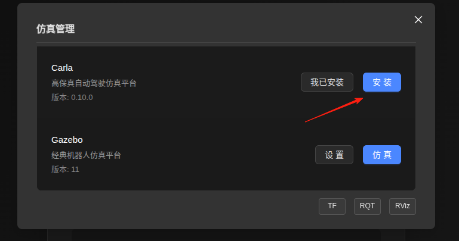
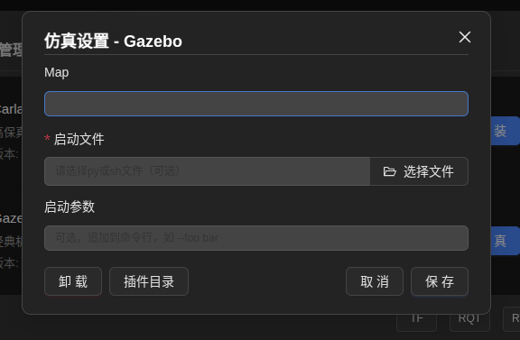
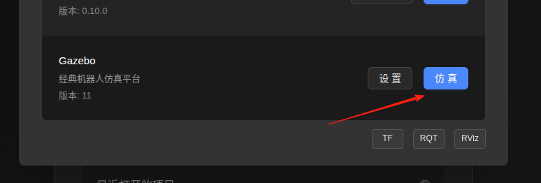

# 仿真管理

仿真管理是系统的重要组成部分，用于创建和管理各种仿真环境。本文档将详细介绍仿真的完整使用流程。

---

## 仿真流程概览

完整的仿真流程包括以下四个主要步骤：

1. **安装仿真** - 获取并安装所需的仿真环境
2. **设置仿真** - 配置仿真参数和环境
3. **选择启动文件** - 指定仿真启动配置
4. **启动仿真程序** - 运行仿真并监控状态

目前FutureDrive支持两种主流的仿真程序，分别是Carla和Gazebo

---

## 1. 安装仿真

对于Carla这种仿真的安装需要进行文件下载，下载前会询问您保存的位置，选择对应的目录即可

**安装完成后，您将看到安装成功的提示信息。**

---

## 2. 设置仿真

安装完成后，点击"设置仿真"进入配置界面。在这里您可以设置：

- **启动文件** - 启动文件是一种集成化的启动方式，例如carla中启动文件可以对物理引擎，传感器或者世界环境进行自定义，您可以通过FutureDrive的市场来进行下载相关资源快速启动

### 保存配置

完成参数设置后，点击"保存配置"按钮将设置保存到本地。系统会提示配置保存成功。

---

## 3. 启动仿真程序

完成上述步骤后，点击"仿真启动程序"按钮开始运行仿真。

## 注意事项

1. **系统要求**：确保您的系统满足仿真环境的最低配置要求
2. **网络连接**：安装仿真时需要稳定的网络连接
3. **存储空间**：仿真环境可能需要较大的存储空间
4. **环境安装**：某些仿真功能需要依赖环境，请确保依赖已安装

---

## 故障排除

如果遇到问题，请检查：

- 仿真环境是否正确安装
- 配置文件是否完整
- 启动文件是否存在
- 系统资源是否充足

如需更多帮助，请参考系统日志或联系技术支持。